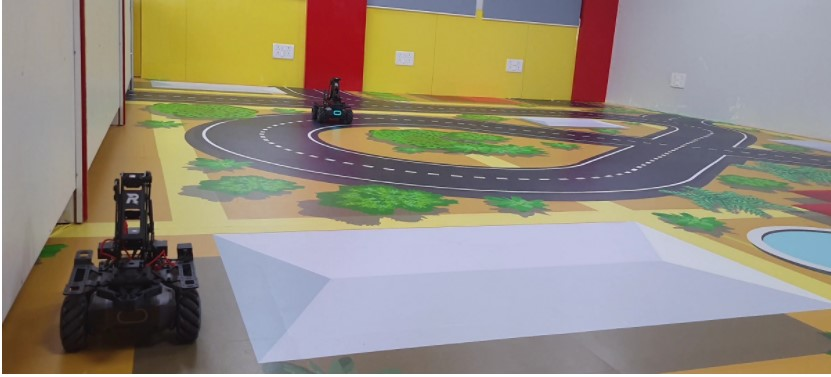
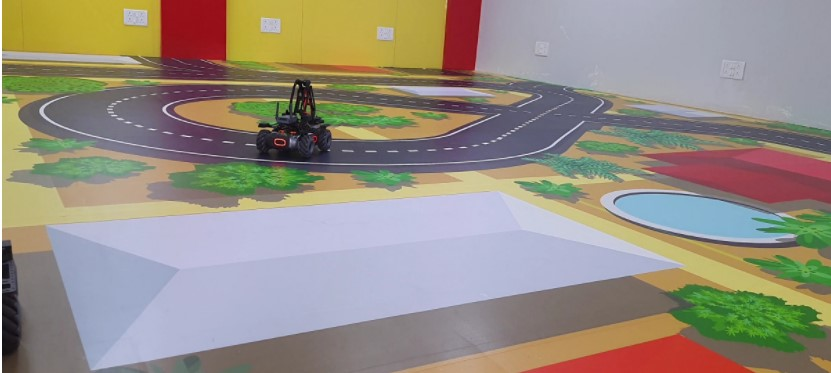

# MobileRobot-Openloopcontrol
## Aim:

To develop a python control code to move the mobilerobot along the predefined path.

## Equipments Required:
1. RoboMaster EP core
2. Python 3.7

## Procedure

Step1:

initiate the MobileRobot.

Step2:

connect your PC with the MobileRobot.

Step3:

open python program.

Step4:

program the movements of the robot using python code.

Step5:

execute the python.

## Program
~~~
from robomaster import robot
import time
from robomaster import camera

if _name_ == '_main_':
    ep_robot = robot.Robot()
    ep_robot.initialize(conn_type="ap")

    ep_chassis = ep_robot.chassis
    
    ep_camera = ep_robot.camera
    '''
    x = x-axis movement distance,( meters) [-5,5]
    y = y-axis movement distance,( meters) [-5,5]
    z = rotation about z axis ( degree)[-180,180]
    xy_speed = xy axis movement speed,( unit meter/second) [0.5,2]
    '''
    print("Camera streaming started...")
    ep_camera.start_video_stream(display=True, resolution=camera.STREAM_360P) 


    ep_chassis.move(x=1, y=0, z=0, xy_speed=0.75).wait_for_completed()
    ep_chassis.move(x=0, y=0, z=90, xy_speed=0.75).wait_for_completed()
    ep_chassis.move(x=1, y=0 ,z=0, xy_speed=0.75).wait_for_completed()
    ep_chassis.move(x=0, y=0 ,z=90, xy_speed=0.75).wait_for_completed()
    ep_chassis.move(x=0.5, y=0 ,z=0, xy_speed=0.75).wait_for_completed()
    ep_chassis.drive_speed(x=0.2,y=0,z=15)
    time.sleep(14)
    ep_camera.stop_video_stream()
    print("Stopped video streaming...")
    ep_robot.close()


## MobileRobot Movement Imaage:
~~~


Insert image here



## MobileRobot Movement Video:

Upload your video in Youtube and paste your video-id here

https://youtu.be/BwoM7Sri-BE


## Result:
Thus the python program code is developed to move the mobilerobot in the predefined path.


<br/>
<br/>

```
Mobile Robotics Laboratory
Department of Artificial Intelligence and Data Science/ Machine Learning
Saveetha Engineering College
```
